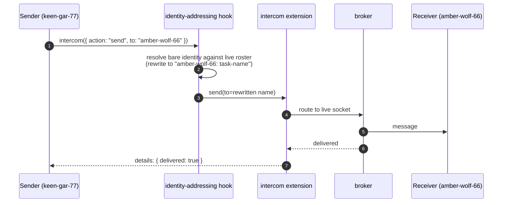
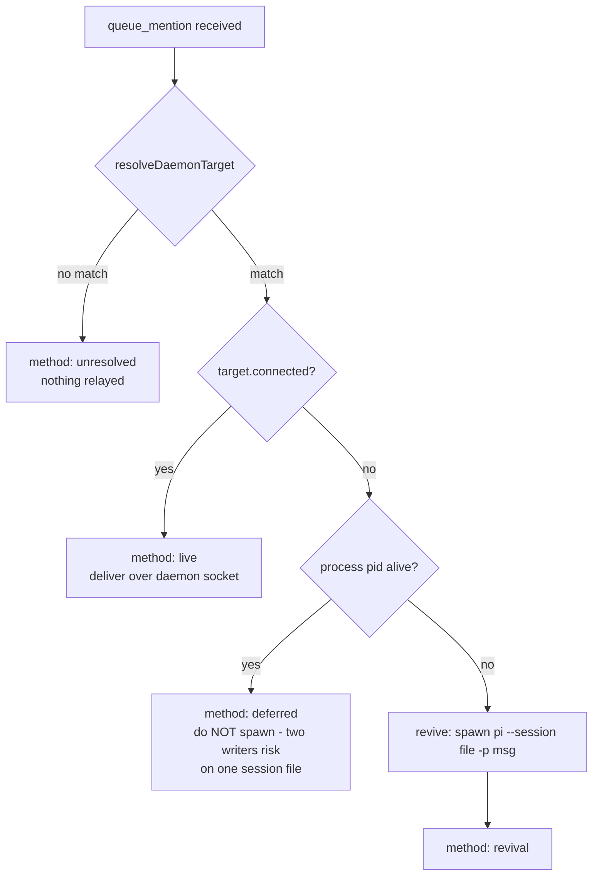

# pi-agent-identity

[](https://deepwiki.com/elecnix/pi-agent-identity)


Gives each pi session a unique persistent identity so AI agents can collaborate across sessions via intercom.

## Architecture

- **Pi extension** (`agent-identity/index.ts`): Name generation, system prompt identity rules, daemon client, git commit co-author hook
- **Detached daemon** (`agent-identity/daemon.ts`): Singleton Unix socket server, offline (ghost) agent tracking, disconnected session revival

## Install

```bash
pi install git:github.com/elecnix/pi-agent-identity
```

## How it works

1. Each pi session gets a random name like `swift-koala-42`
2. Sessions register with a **detached singleton daemon** via Unix socket
3. The daemon keeps tracking **disconnected agents** so they remain reachable — but hidden from the intercom roster list; `agent_search` finds them by name or ghost id
4. **Disconnected sessions are revived**: the daemon spawns `pi --session <file> -p "message"` when an intercom message arrives for an offline agent
5. **Agent lookup**: The daemon exposes a `lookup_agent` message so pi core can resolve agent names to session files, enabling `--session <name>` (requires pi >= next release after PR [earendil-works/pi#5987](https://github.com/earendil-works/pi/pull/5987))
6. **Filesystem fallback**: If the daemon has no record of an agent (e.g. after a reboot wiped its `/tmp` registry), lookup falls back to scanning `~/.pi/agent/sessions/**/*.jsonl` for the session whose embedded `agent-identity-name` matches, and resumes the most recent one. The daemon registry is a cache; the session files are the durable source of truth. Override the scan root with `PI_SESSIONS_DIR`.
7. **Addressing by immutable identity**: the agent identity (e.g. `keen-gar-77`) is the addressable subject; the session name is mutable display metadata. On intercom `send`/`ask`, a bare identity is resolved against pi-intercom's live roster (via its extension-bus channel, ≥ 0.12) and rewritten to the registered composite name (`keen-gar-77: fix-auth-bug`) when needed — so peers stay addressable by bare name after `session_rename`. Each session also publishes `{ agentName }` on the silent `agent-identity/v1` bus namespace. If delivery still fails, the daemon relay reports honestly what happened (live delivery, revival, deferred, unresolved) and never spawns a second `pi` process against a live session file.

## Message flows

### Architecture

Every pi session runs two extensions that talk to two independent singletons:

```mermaid
flowchart LR
    subgraph SenderPi["pi session (sender)"]
        S1["intercom extension"]
        S2["agent-identity extension"]
    end
    subgraph Broker["pi-intercom broker<br />(live-session message router)"]
        B1["roster of connected sessions"]
    end
    subgraph Daemon["agent-identity daemon<br />(singleton, unix socket)"]
        D1["registry: agent-name → session-file<br />pid, connected flag, cwd, repo"]
    end
    S1 --| "message frames" | B1
    S2 --| "register / lookup / queue_mention" | D1
    D1 -. "revival: spawn pi --session &lt;file&gt; -p &lt;msg&gt;" .-> R1
    R1["revived pi session (receiver)"]
```

- **pi-intercom** has no durable memory: it routes text only between *currently connected*
sockets. Offline agents deliberately do **not** appear in its roster.
- **agent-identity daemon** is the control plane: it knows every agent that ever
registered — online or not — and is the only component that can *revive* one.

### Sending to an online agent

When the target is connected, the daemon is not involved at all:



### Sending to an offline agent (revival)

If the target is offline, the broker cannot find it. The send fails, and the
agent-identity extension catches that failure on the tool result and routes the
message through the daemon instead:

```mermaid
sequenceDiagram
    autonumber
    participant S as Sender (keen-gar-77)
    participant RW as identity-addressing hook
    participant IC as intercom extension
    participant BR as broker
    participant ES as identity extension (tool-result hook)
    participant D as agent-identity daemon
    participant RV as revived pi (amber-wolf-66)
    S->>RW: intercom({ action: "send", to: "amber-wolf-66" })
    RW->>IC: send(to="amber-wolf-66")
    IC->>BR: route
    BR-->>IC: E_TARGET_NOT_FOUND<br />(not in live roster)
    IC-->>S: details: { delivered: false, code }
    Note over ES: hook on intercom tool_result
    ES->>ES: extract target + message body
    ES->>D: queue_mention { targetName, fromName, body }
    D->>D: resolveDaemonTarget(name, registry)
    alt target connected
        D-->>ES: mention_queued { method: "live" }
    else process alive, socket unreachable
        D-->>ES: mention_queued { method: "deferred" }<br />(do NOT spawn a second writer)
    else pid dead
        D->>RV: spawn pi --session &lt;file&gt; -p &lt;message&gt;
        D-->>ES: mention_queued { method: "revival" }
    else no registry match
        D-->>ES: mention_queued { method: "unresolved" }
    end
    ES-->>S: honest report (live / revival / deferred / unresolved)
```

### Daemon decision path on `queue_mention`



Revival is deliberately conservative: the daemon never spawns a second `pi`
against a session file whose process is still alive, and it reports what it
actually did instead of pretending an offline peer got the message.

## Daemon protocol

JSON messages of `{ type, ... }` over the unix socket, one per line.

| Message | Request | Response |
|---------|---------|----------|
| `register` | `{ type: "register", agentName, sessionFile, pid, repo?, cwd? }` | `{ type: "ack", agentName }`, updates the in-memory registry and persists it to `/tmp/agent-identity-daemon-registry.json` |
| `unregister` | `{ type: "unregister", agentName }` | — (used on explicit shutdown; sessions normally stay registered so they can be revived) |
| `lookup_agent` | `{ type: "lookup_agent", agentName }` | `{ type: "agent_found", name, sessionFile, connected, pid, active, repo }` or `{ type: "agent_not_found", agentName }` |
| `list_agents` | `{ type: "list_agents" }` | `{ type: "agent_list", agents: [...] }` (used for collision-free name minting) |
| `queue_mention` | `{ type: "queue_mention", targetName, fromName, body }` | `{ type: "mention_queued", targetName, method }` where method ∈ `live` \| `revival` \| `deferred` \| `unresolved` |
| `ping` | `{ type: "ping" }` | `{ type: "pong" }` (liveness) |
| `version_check` | `{ type: "version_check", version }` | `{ type: "version_ok", version }` or `{ type: "version_mismatch", expected, received }` |

### Delivery guarantees and failure modes

The relay is best-effort by design. Messages can be lost when any of these
hold:

- the **daemon is down or the socket is stale** — the tool-result hook bails on
  `!socket.writable` and no relay attempt happens at all;
- the target process is **alive but socket-unreachable** — the daemon replies
  `deferred` and does not keep the message;
- the broker's **24h mailbox** for recently-disconnected sessions is evicted
  (`MAX_MAILBOX_MESSAGES`) or pruned after `DISCONNECTED_SESSION_RETENTION_MS`;
- the daemon does not answer within the **3s relay verdict window**
  (`RELAY_VERDICT_TIMEOUT_MS`), leaving the send `unresolved`;
- the **agent name never registered** — `queue_mention` resolves to no entry and
  returns `unresolved`.

The extension reports each outcome honestly (`buildRelayReport`), so the sender
never believes a message was delivered when it was not.

## Commands

| Command | Description |
|---------|-------------|
| `/whoami` | Show your agent identity |
| `/agent-status` | Daemon connection status |
| `/agent-reconnect` | Force reconnect to daemon |
| `/resume-agent` | Switch to another agent's session by name |

## Tools

| Tool | Description |
|------|-------------|
| `session_rename` | Let the agent rename its own session to reflect the task. The agent name stays as the prefix (`keen-gar-77: fix-auth-bug`). The description instructs the LLM to call it immediately on the first user message that conveys intent. |
| `agent_search` | Search registered agents by (partial) name — exact matches rank first, then prefix matches — returning full registered intercom names and online/offline status. Resolves addresses from a short fragment without dumping hundreds of roster entries into the transcript. |

## Asking offline agents (#8)

`ask` to an offline (revivable) agent cannot block — a revived session has no reply-waiter. Instead of failing hard with "Session not found", the relay revives the target with the questions framed for an answer-back, and reports honestly that the reply will arrive asynchronously.

## Offline targeting (#7) and hidden ghosts

Disconnected-but-revivable agents are **hidden from the intercom roster list** (the daemon no longer registers ghost sessions with the broker). They stay addressable under a deterministic id (`agent-<agent-name>`): `agent_search` surfaces offline agents with this id, and a message sent by name or id that fails at the broker is routed through the daemon's `queue_mention`, which revives the real session. The queued message redelivers when the live session returns in the same project.

## Name minting

Fresh names are drawn collision-free: before adopting a minted name, the extension queries the daemon's registry (`list_agents`) and re-rolls (up to 10 draws) if the name still belongs to a disconnected-but-revivable agent. This prevents a same-name remint from splitting an identity's message routing (#34).

## Bash environment

The extension exposes the agent identity to every LLM-callable `bash` subprocess as `PI_AGENT_NAME`. The name is set on the pi process at session start via `process.env`, so spawned shell children inherit it; pi resolves the bash env per execution, so every bash tool command sees the current agent name.

pi core's own session metadata vars (`PI_SESSION_ID`, `PI_PROVIDER`, `PI_REASONING_LEVEL`, etc.) are unaffected. To pin an identity before launch, just pass `AGENT_IDENTITY_NAME` (already used for testing and daemon revival):

```bash
AGENT_IDENTITY_NAME=swift-koala-42 pi -p "run a bash command"
```
